# LR6
Лабораторная работа №6
#### Ход работы
Для начала я создал аккаунт на Github. После этого сделал копию исходного репозитория к себе. После скачал и установил Git.
Первым делом настроил Git введя параметры `email git config --global user.name <username>` и `git config --global user.email <email>`.
Затем с помощью `git clone <url>` загрузил репозиторий.

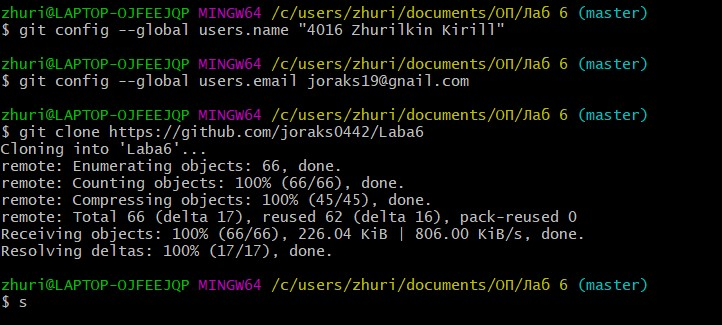

После этого добавил в репозиторий файл "new file.txt." и с помощью `git pull`

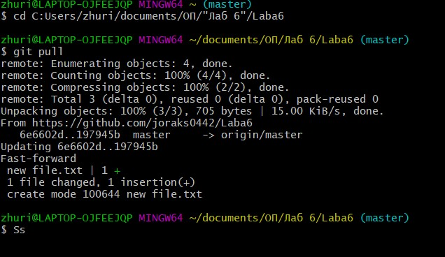

Далее с помощью команда `git log` запрашиваем историю изменений ветки, а с помощью `git checkout <name>` переключаемся между ветками

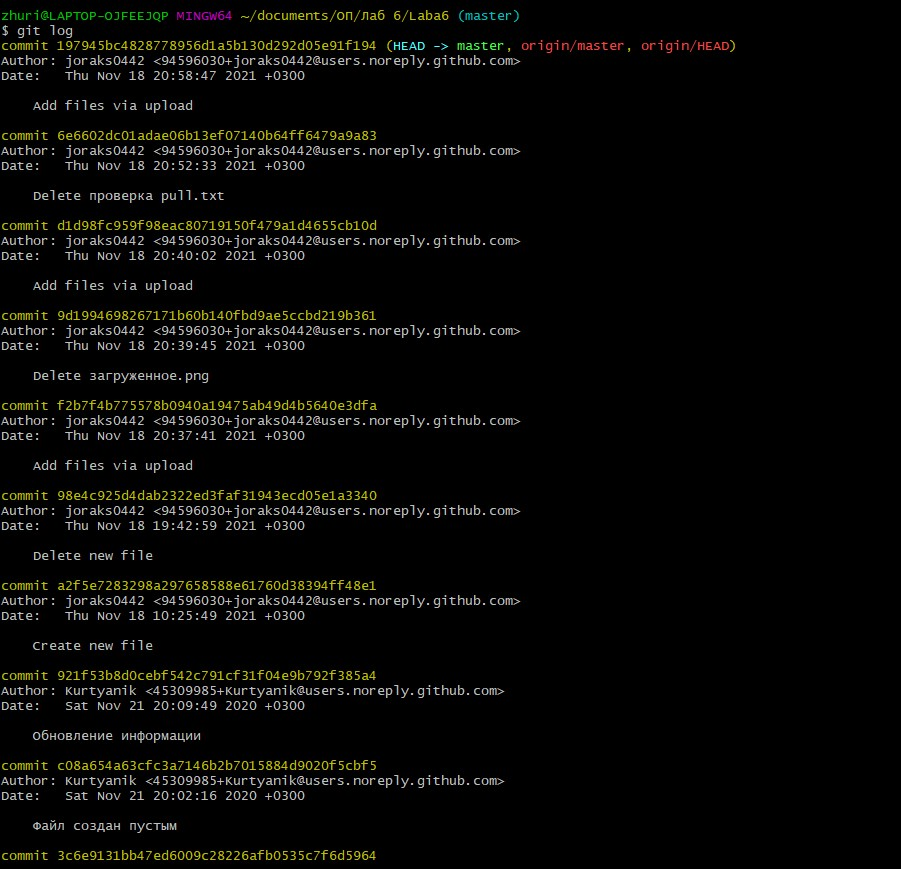

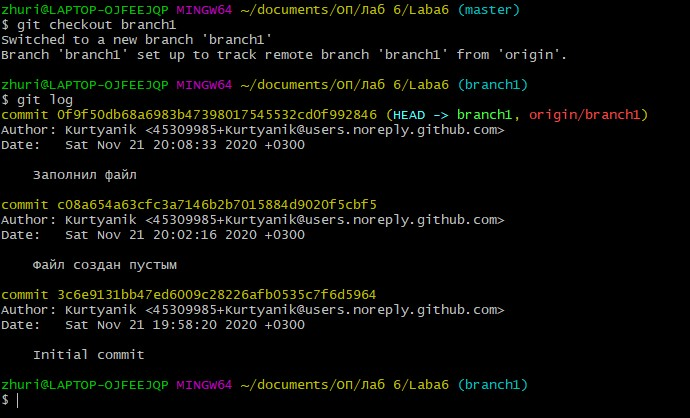

Далее пытаемся объеденить ветки masters и branch1 командой `git merge branch1` решил проблему слияния вручную с помощью команды `nano <name`>, затем `git add <name>` и `git commit`, имя коммита было предложено автоматически "Merge branch "branch1"

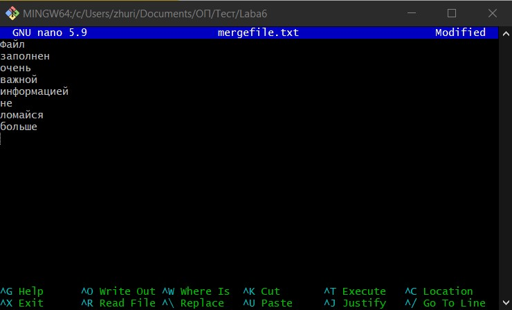

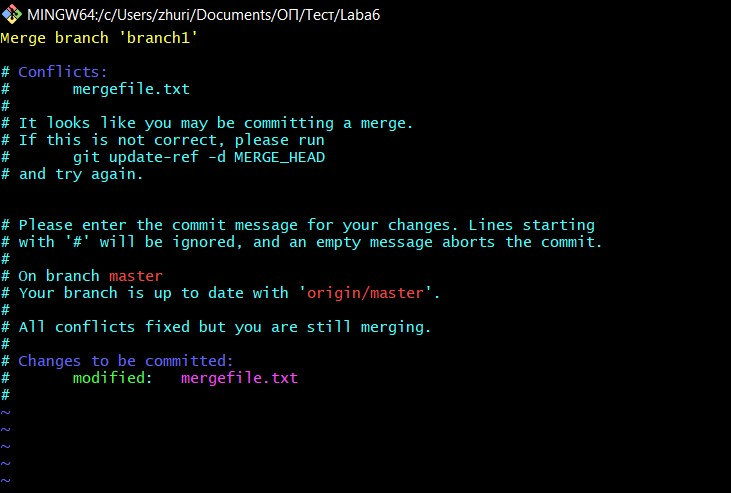

После чего была выполнена команда `git add *` и сделан коммит.
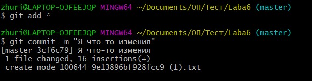
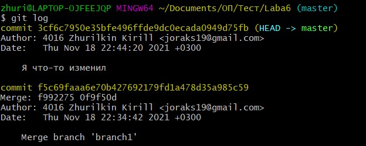

Затем был произведене хард откат `git reset --hard <name>`

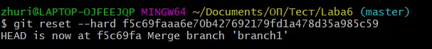
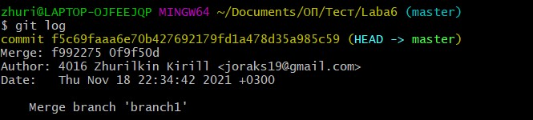

Далее создал папку "Screenshots", которую поместил несколько скриншотов и добавил их в репозиторий, после чего сделал коммит и загрузил все на github

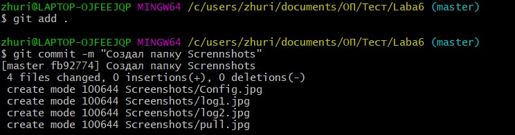

После чего создал ветку репорт и начала делать отчет, в процессе работы сохранил файл, сдела коммит и опять же загрузил все на github

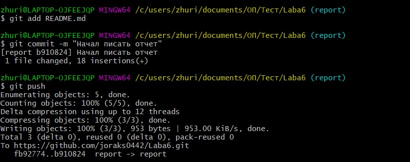

После чего запросил логи в кратком формате "сокращённый хэш + дата + имя автора + комментарий"

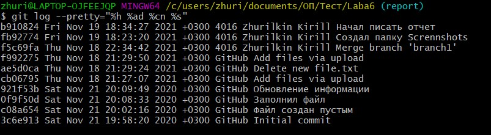

Также я забыл удалить побочную ветку, поэтому сделал это в конце.

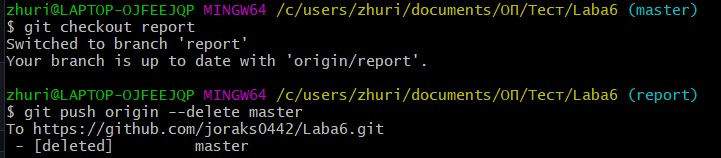

Закончил отчет и загрузил обновил репозиторий на Github.